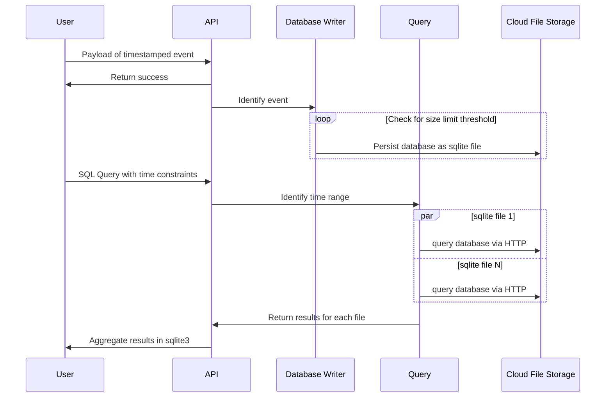

# sqlite times series databases with s3 cold storage

This database is designed to store and manage data over a period of time, and
can handle a large volume of data being added to it. It can be used with a
programming language called SQL to retrieve and manipulate the data, rather than
using a custom language.

## Usage

### Development

Setting up your local development. These instructions are for MacOS.

```bash
brew bundle
task
```

## Motivation

Querying is a crucial aspect of working with time-series databases, and various
query languages have been developed to support this task, such as
[Prometheus Query Language (promQL)](https://prometheus.io/docs/prometheus/latest/querying/basics/),
[Search Processing Language (SPL)](https://docs.splunk.com/Documentation/SplunkCloud/9.0.2209/SearchTutorial/Usethesearchlanguage),
[CloudWatch Logs Query Syntax (CWL)](https://docs.aws.amazon.com/AmazonCloudWatch/latest/logs/CWL_QuerySyntax.html)).
These languages provide users with flexibility in exploring their data and can
be extended to meet specific needs.

However, as a seasoned engineer, I have often found myself translating SQL
queries into these other languages, which may not have a one-to-one mapping but
can help me understand the shape of the data and the queries I want to write.

This documentation, which is driven by
[`README` development](https://tom.preston-werner.com/2010/08/23/readme-driven-development.html),
is motivated by my desire to be able to query time-series data more effectively
and will be updated as changes and discussions take place.

## Requirements

This outlines the envisioned requirements for the application:

- Utilize the [`sqlite3`](https://www.sqlite.org/index.html) standard file
  format, which is established and backwards compatible to 2050.
- Leverage AWS S3 and other file storage solutions for scalability and long-term
  data retention.
- Allow users to download individual files from the cloud storage. The end user
  only needs `sqlite3` installed, reducing the barrier to entry and increasing
  accessibility.
- Provide human readable file names with relevant metadata, such as time series
  range.
- Ensure fast writes with no back pressure to event providers.
- Enable querying of data across time ranges using SQL query, placing importance
  on consistency and valid data over speed.
- Have queries load data directly from file storage, rather than requiring local
  copies.
- Implement a horizontal scalability approach in order to avoid file collisions.

### Sequence Diagram

This is the user flow of the application. It is high level, doesn't influence
the software architecture.



### API

These are the API endpoints that can be used for the events. It provides both
query and writing of events.

#### Write

- PUT `/api/events` submits an event to the writer service. It will perform
  validations on the submitted JSON payload and return appropriate errors.
  Returns `200 OK` all other times.

  ```json
  {
    "timestamp": 1673205162254,
    "labels": {
      "product_name": "Terracotta Coffee Mug",
      "order_id": "123456"
    },
    "value": "Someone really enjoy their order, we should remind them in the future to order more."
  }
  ```

#### Query

- GET `/api/events/query` allows a query for to be done across the time-series
  data store in the cloud file storage. It will attempts to load data from all
  corresponding files. It has no limits, which means queries can take a long
  time.

  ```json
  {
    "query": "SELECT payload->'product_name' FROM events WHERE events('order_id 111')",
    "range": {
      "start": "2022-01-01",
      "end": "2022-12-31"
    }
  }
  ```
